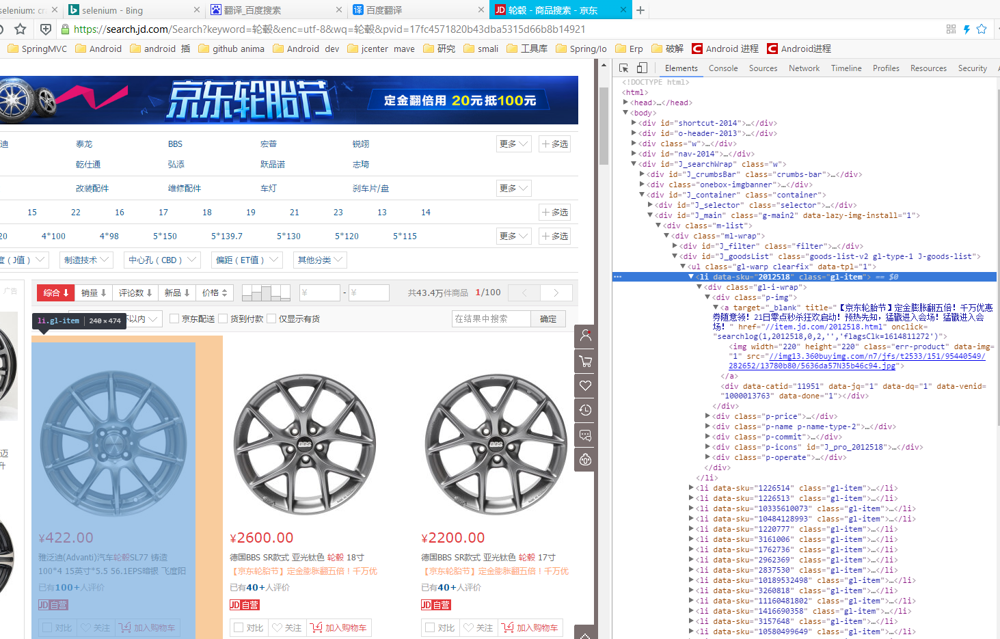
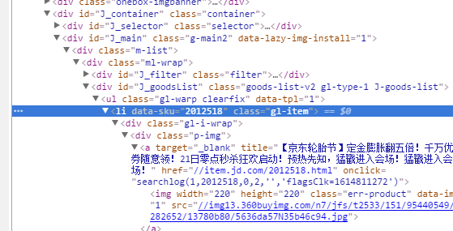
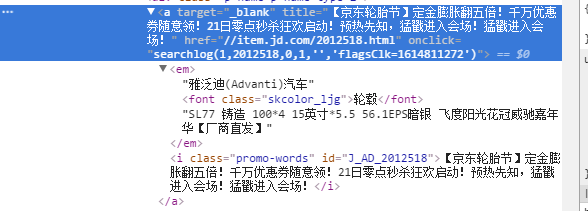
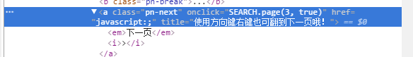

# selenium

## 爬取京东

```pyton
from selenium import webdriver
import time


# 关闭打开京东时网页欢迎页面
def closeMask(driver):
    try:
        mask = driver.find_element_by_xpath('//*[@id="guide-price"]/div[2]/a')
        mask.click()
    except:
        pass


# 判断京东有无下一页
def hasNextPage(driver):
    try:
        onclick_source = driver.find_element_by_class_name("pn-next").get_attribute("onclick")
        if onclick_source is not None:
            return True
    except:
        return False


# 返回下一页，没有返回None
def getNextPage(driver):
    try:
        onclick_source = driver.find_element_by_class_name("pn-next").get_attribute("onclick")
        return onclick_source
    except:
        return None


def grabData(driver):
    lis = driver.find_elements_by_xpath('//*[@id="J_goodsList"]/ul/li')
    index = 0
    while True:
        if index < len(lis):
            li = lis[index]
            li.location_once_scrolled_into_view
            time.sleep(1)
            print("节点%d信息" % index)
            sku=li.get_attribute("data-sku")
            img_ulr = li.find_element_by_xpath('div[1]/div[1]/a[1]/img').get_attribute("src")
            title = li.find_element_by_xpath('div/div[3]/a').text
            price = li.find_element_by_xpath('div/div[2]/strong').text
            print(sku,price, title, img_ulr)
            lis = driver.find_elements_by_xpath('//*[@id="J_goodsList"]/ul/li')
            print("本页总数据",len(lis))
            index = index + 1
        else:
            break


def scroll2NextPage(driver):
    next = driver.find_element_by_class_name("pn-next")
    driver.execute_script('arguments[0].scrollIntoView({ behavior: "smooth"});', next)

def scrollTop(driver):
    driver.execute_script("$('html, body').animate({scrollTop: 0,scrollLeft:0});")

def start(driver):
    driver.get("https://search.jd.com/Search?keyword=%E8%BD%AE%E6%AF%82&enc=utf-8&wq=%E8%BD%AE%E6%AF%82&pvid=31069b4d12884271b7313b667b002fcf")
    closeMask(driver)
    pageNum=0
    while True:
        nextPage = getNextPage(driver)
        if nextPage is not None:
            print("当前页码：",pageNum)
            scrollTop(driver)
            driver.execute_script(nextPage)

            time.sleep(10)
            # 抓取数据
            grabData(driver)
            pageNum = pageNum + 1
        else:
            break
    print("quite")


driver = webdriver.Chrome()
start(driver)

```

京东商品搜索结果列表dom节点结构

获取所有的商品列表

```python
# 可以用Chrome浏览器选中元素按右键--inspect(检查元素)--选中右侧dom节点--copy--copy as xpath
# 选择所有的商品列表
lis = driver.find_elements_by_xpath('//*[@id="J_goodsList"]/ul/li')

```

对商品列表元素li进行遍历

```python
li = lis[index]
# location_once_scrolled_into_view让节点滚动到可见区域,这样才能节点上的数据被加载
li.location_once_scrolled_into_view
# 移动节点到可见区域之后等待1秒，注意单位是秒，等待数据加载，需要导包（import time）
time.sleep(1)

```

提取数据,节点结构如下


```python
#获取sku属性值，注意这里不是get_property
sku=li.get_attribute("data-sku")
```

```python
# 在li下面寻找以下节点
 img_ulr = li.find_element_by_xpath('div[1]/div[1]/a[1]/img').get_attribute("src")

```

下面是text属性


```python
# 它会读取 a标签的text和里面嵌套的其它标签的text值
title = li.find_element_by_xpath('div/div[3]/a').text
# 读取内容： 雅泛迪(Advanti)汽车轮毂RA83 铸造 120*5 18英寸*8 ET35 CBD72.5 GBFP黑亮面 宝马135系X1X3【厂商直发】
```

```python
# 是因为京东第一次加载30个商品，所以循环更新lis不然只能第一次加载的30商品，后来加载的就爬不了
print(sku,price, title, img_ulr)
lis = driver.find_elements_by_xpath('//*[@id="J_goodsList"]/ul/li')
```

```python
# 用jquery滚动浏览器到顶部
driver.execute_script("$('html, body').animate({scrollTop: 0,scrollLeft:0});")
```

提取京东点击下一页时的js代码并执行


```python
def getNextPage(driver):
    try:
        onclick_source = driver.find_element_by_class_name("pn-next").get_attribute("onclick")
        return onclick_source
    except:
        return None
```

```python

# 加载下一页
driver.execute_script(nextPage)
```